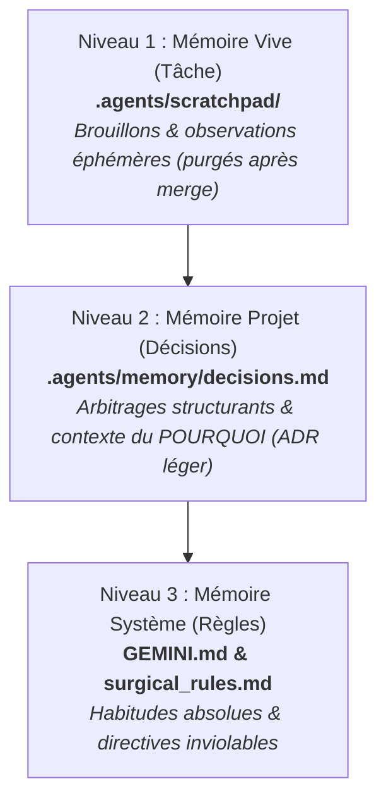

# ⚔️ Règles Chirurgicales & Boucle d'Élasticité (Protocole Brooks-Zero)

> **Référence théorique** : Loi de Brooks & Expérience des 1200 agents autonomes.
> L'ajout anarchique d'agents produit une surcharge de communication quadratique $O(N^2)$, des conflits de code insolubles et une dérive d'alignement. 
> Ce projet applique le modèle de l'**Équipe Chirurgicale** (Fred Brooks, IBM) : **une seule main tient le bistouri (l'écriture du code final)**.

---

## 1. Principes Fondamentaux & Topologie

1. **Topologie en Étoile Stricte ($O(N)$)** :
   - Le Lead Agent agit comme **Chirurgien Unique**.
   - Les sous-agents ne communiquent **JAMAIS** directement entre eux. Tout échange transite obligatoirement par le Chirurgien.
2. **Monopole d'Écriture (Le Bistouri Unique)** :
   - Seul le Chirurgien modifie le code source du dépôt (`src/`, `api/`, configuration).
   - Les sous-agents sont restreints à un mode `read-only` sur le codebase, avec autorisation d'écriture exclusivement dans une note temporaire : `.agents/scratchpad/worker_{id}.md`.
3. **Zéro Inflation de Fichiers de Rôles** :
   - Ne pas multiplier les fichiers de rôles dormants dans `.agents/roles/`.
   - Les sous-agents sont éphémères, instanciés dynamiquement avec une instruction précise au moment du besoin et détruits dès l'achèvement de la tâche.

---

## 2. Boucle Logique d'Élasticité Dynamique (Scaling Policy)

Le Chirurgien évalue au début de chaque cycle si l'instanciation d'un sous-agent temporaire est requise.
**Par défaut : Effectif = 1 (Chirurgien seul).**

### A. Conditions d'Ajout (Scale-Up)
Instancier un sous-agent éphémère **UNIQUEMENT** si au moins l'une des conditions suivantes est remplie :

- [ ] **Isolation Stricte** :
  - Audit de sécurité approfondi, diagnostic de performance ou revue de conformité WCAG/ATS sans besoin d'écriture immédiate.
- [ ] **Explosion Combinatoire / Parallélisation Sèche** :
  - Exécution ou analyse de plus de 3 benchmarks, matrices de compatibilité ou tests exploratoires indépendants.
- [ ] **Cloisonnement de Contexte (Context Shielding)** :
  - Ingestion ou fouille d'une documentation volumineuse (> 20 000 tokens) ou d'un rapport externe massif qui saturerait inutilement la fenêtre de contexte du Chirurgien.

> **Garde-fous d'Instanciation :**
> - **Modèle** : Préférer un modèle rapide et économique (ex: `flash`) pour les sous-agents d'exploration.
> - **Permissions** : `read-only` sur le repo. Sortie livrée dans `.agents/scratchpad/worker_{id}.md`.
> - **Plafond Strict** : **Maximum 2 sous-agents actifs simultanément**.

---

### B. Conditions de Retrait / Destruction Immédiate (Scale-Down)
Détruire immédiatement le sous-agent et récupérer la main si :

- [ ] **Conflit Logique** : Le sous-agent formule une recommandation en contradiction avec `.agents/memory/decisions.md` ou les règles système.
- [ ] **Taux de Reprise Élevé** : Le Chirurgien doit corriger ou recadrer l'output du sous-agent plus d'une fois.
- [ ] **Fin de Tâche Unitaire** : Dès que l'analyse ou la note de synthèse est déposée dans le scratchpad, l'agent est clos.
- [ ] **Dépassement de Quota** : Consommation excessive de tokens sans livrable concret exploitable.

---

### C. Économie de Contexte & Interdiction du Polling Actif (Anti-Token-Burn)
*Inspiré de l'incident GPT-6 Astra / Codex : 47 sondages à vide toutes les 30s = 7,13M tokens d'entrée brûlés pour 0 résultat.*

1. **Zéro-Polling Actif** :
   - Ne **JAMAIS** boucler sur `manage_task(status)` ou configurer des `schedule` de réveil fréquents (< 15 minutes) pour demander si un travailleur a fini.
   - Utiliser **exclusivement le réveil événementiel (Push Notification)** : dès qu'un sous-agent ou une commande de fond est lancé, le Chirurgien **cesse d'appeler des outils** et cède la main. Le runtime réveille automatiquement l'agent dès réception du message ou fin du processus.
2. **Cloisonnement du Scratchpad** :
   - Les sous-agents ne doivent pas envoyer de messages de bavardage ("j'avance", "50% fait") au parent.
   - Les résultats intermédiaires sont consignés dans `.agents/scratchpad/worker_{id}.md`. Le sous-agent n'envoie qu'un seul message final concis au Chirurgien lorsqu'il a terminé.
3. **Plafond de Temporisation de Sécurité** :
   - Si un timer de secours doit impérativement être posé contre un éventuel blocage, la durée minimale est de **20 à 25 minutes** (dans la fenêtre de réutilisation du cache de prompt), jamais sous la minute.

---

## 3. Protocole de Mémoire Partagée : "Découper, Trancher, Garder"

Pour éviter la saturation et la dérive cognitive, la mémoire du projet est structurée en 3 couches étanches :

1. **Découper (Niveau 1 — Scratchpad)** :
   - Le sous-agent analyse son périmètre et consigne ses constats dans `.agents/scratchpad/worker_{id}.md`.
2. **Trancher (Niveau 2 — Arbitrage)** :
   - Le Chirurgien lit la note, valide ou rejette les conclusions, et applique lui-même les changements de code pertinents.
   - La note temporaire `.agents/scratchpad/worker_{id}.md` est purgée dès l'intégration terminée.
3. **Garder (Niveau 3 — Décisions & Habitudes)** :
   - Si l'intervention résout un problème récurrent ou acte un choix d'architecture fondamental, le Chirurgien consigne l'arbitrage dans `.agents/memory/decisions.md` avec le format standardisé :
     `Date | Contexte / Problème | Décision Tranchée | Raison`.
   - Seul l'humain valide la promotion d'une décision en règle système pérenne (`GEMINI.md`).
