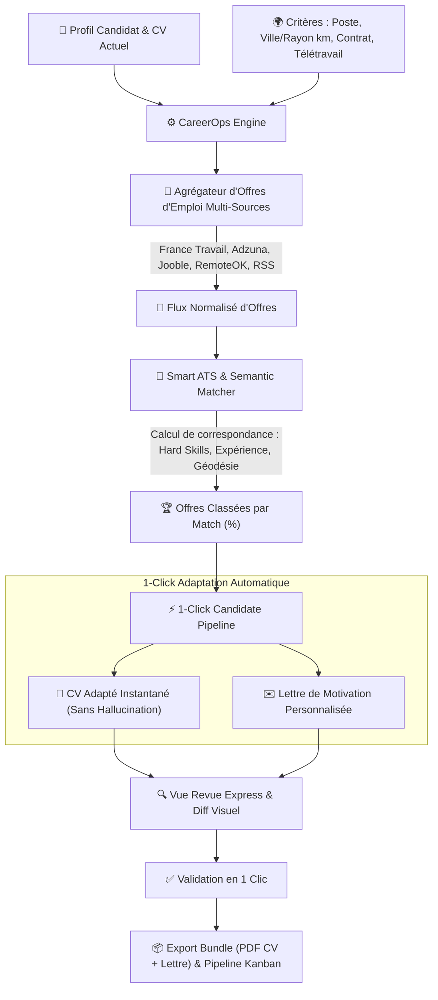

# 📐 Manuel d'Architecture & Charte de Qualité Universelle — Resume & CareerOps

---

## 1. Philosophie & Cadre Éthique pour Agents IA

Tout agent ou développeur opérant sur la plateforme **Resume & CareerOps** est soumis aux **7 Piliers d'Ingénierie & Gouvernance IA** :

```text
       ┌─────────────────────────────────────────────────────────────────────────────┐
       │                   LES 7 PILIERS D'INGÉNIERIE & GOUVERNANCE IA               │
       └─────────────────────────────────────────────────────────────────────────────┘
          │                   │                   │                   │
  ┌───────▼───────┐   ┌───────▼───────┐   ┌───────▼───────┐   ┌───────▼───────┐
  │   VÉRITÉ &    │   │  AUDIT & TEST │   │  SÉCURITÉ &   │   │  RÉSILIENCE   │
  │   RIGUEUR     │   │   CONTINU     │   │  PERFORMANCE  │   │ DES CASCADES  │
  │ (Zéro-Fake)   │   │  (Harnais)    │   │   (No-Leak)   │   │    (APIs)     │
  └───────────────┘   └───────────────┘   └───────────────┘   └───────────────┘
          │                                       │                   │
  ┌───────▼───────┐                       ┌───────▼───────┐   ┌───────▼───────┐
  │ UTILITÉ PURE  │                       │ ORCHESTRATION │   │ GOUVERNANCE   │
  │ (Zero-Gadget) │                       │  MULTI-AGENTS │   │ COGNITIVE &   │
  │ (Moins Couches│                       │ (Partition)   │   │ DISJONCTEURS  │
  └───────────────┘                       └───────────────┘   └───────────────┘
```

---

## 2. Pilier 1 : Vérité Factuelle, Zéro Fake & Honnêteté Radicale

- **Anti-Hallucination Absolue (Radical Truth)** : L'IA ne doit JAMAIS inventer d'expérience professionnelle, d'entreprise, d'école, de certification ou de compétence technique absente des déclarations réelles de l'utilisateur.
- **Transparence des Lacunes (Skill Gap)** : Si une offre d'emploi requiert des compétences que le candidat n'a pas, le système les signale explicitement au lieu de simuler une adéquation parfaite trompeuse (*Anti-Sycophancy*).
- **Formules Primaires & Scientifiques** :
  - Formule Harvard XYZ pour les accomplissements : $\text{Action} + \text{Métrique mesurable} + \text{Méthode/Contexte}$.
  - Distance Géodésique de Haversine pour le calcul d'éloignement candidat $\leftrightarrow$ offre d'emploi :
    $$d = 2R \arcsin \left( \sqrt{\sin^2\left(\frac{\Delta \phi}{2}\right) + \cos(\phi_1)\cos(\phi_2)\sin^2\left(\frac{\Delta \lambda}{2}\right)} \right)$$

---

## 3. Pilier 2 : Harnais d'Audit & Tests Automatisés

- **Tests Unitaires & Intégration (Vitest)** : Couverture rigoureuse de la validation des formats de CV, sanitization, reducers, exporters et scoring ATS.
- **Harnais de Résilience API** : Validation automatisée des codes HTTP 200, 400, 401, 405, 429 et des fallbacks déterministes.
- **Harnais d'Audit UX & Accessibilité (WCAG AAA)** : Contrôle des ratios de contraste, des focus visibles et de la conformité mobile.

---

## 4. Pilier 3 : Sécurité & Performance sans Compromis

- **Zéro Fuite de Clés Côté Client** : Les clés API (`GEMINI_API_KEY_MASTER`, tokens d'agrégation d'emplois) sont confinées aux serverless functions Vercel.
- **Validation Same-Origin (AuthGuard)** : Vérification systématique des en-têtes HTTP de provenance sur toutes les routes API.
- **Budget 60fps & Gestion Mémoire** : Nettoyage systématique des timers et workers PDF lors de la fermeture des modales pour garantir **0 fuite mémoire**.

---

## 5. Pilier 4 : Résilience des Cascades IA & Cooldown Intelligent

- **Cascade Hiérarchisée Multi-Tiers** :
  1. *Tier 1* : Modèles Haute Capacité (`gemini-3.5-flash-lite`, `gemini-3.1-flash-lite`).
  2. *Tier 2* : Modèles Standard & Raisonnement (`gemini-3.7-flash`, `gemini-3.6-flash`).
  3. *Tier 3* : Modèles Open-Weights (`gemma-4-31b-it`, `gemma-4-26b-a4b-it`, `gemma-2-27b-it`).
  4. *Tier 4* : Moteur Déterministe Local Hors-Ligne.
- **Cooldown Automatique (HTTP 429)** : Mise en quarantaine en mémoire de 5 minutes par modèle saturé sans latence pour l'utilisateur.

---

## 6. Pilier 5 : Standards UI/UX & Accessibilité (WCAG AAA)

- **Palette Sémantique** : Vert Émeraude (`#1B6B3A`), Ardoise (`#0B1120`, `#1E293B`), Ambre (`#F59E0B`), Rubis (`#EF4444`).
- **États Interactifs Explicites** : `:hover`, `:active`, `:focus-visible`, `:disabled`.
- **Confirmation des Actions Destructrices** : Modales explicites pour toute réinitialisation ou suppression.

---

## 7. Pilier 6 : Orchestration Multi-Agents & Rôles Hiérarchiques

- **Chef d'Orchestre (Frontier Orchestrator / Le Musicien)** : Analyse stratégique de la recherche d'emploi et coordination du pipeline de candidature.
- **Fantassins (Specialized Subagents / Les Exécuteurs Bounded)** :
  - `Job Extractor` : Extraction des prérequis d'une offre.
  - `Geodesic Calculator` : Distance kilométrique et rayon géographique.
  - `ATS Matcher` : Calcul de correspondance et scoring de compétences.
  - `CV Tailor Scribe` : Adaptation chirurgicale des puces d'expérience.
  - `Cover Letter Scribe` : Rédaction de lettre de motivation alignée.

---

## 8. Pilier 7 : Gouvernance Cognitive, Anti-Sycophanie & Disjoncteurs

- **Régulation du Reasoning Budget (Anti-Oversinking)** : Budget de réflexion modéré pour l'exécution directe afin de prévenir les dérives.
- **Protocole Anti-Psychophanie** : Zéro complaisance ou flatterie sur des profils inadaptés.
- **Disjoncteurs Budgétaires (Circuit Breakers)** : Plafonnement du nombre d'itérations et comptage de tokens.

---

## 9. Sous-Système "Big CareerOps"



### Fonctionnalités Clés de CareerOps :
1. **Agrégation d'Offres Intelligente** : Recherche par poste, compétences, ville/département, rayon kilométrique et modalité de télétravail.
2. **Scoring de Correspondance ATS & Géodésique** : Calcul automatique du % de match et mise en évidence des points forts et des compétences manquantes.
3. **Adaptation en 1-Clic Sans Friction** : Génération simultanée du CV optimisé et de la lettre de motivation.
4. **Revue Diff Visuel Express** : Comparaison claire avant validation finale.
5. **Suivi Kanban des Candidatures** : Sauvegardée $\rightarrow$ Adaptée $\rightarrow$ Candidatée $\rightarrow$ Entretien $\rightarrow$ Offre.
